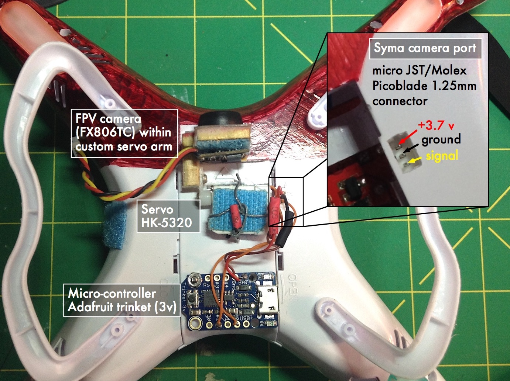

# Syma X5C servo
## Controlling a servo using the Syma X5C's camera port &amp; an Arduino compatible micro-controller

 *******************************************************************
 
 - [Introduction](#introduction)
 - [Demo](#demostration)
 - [Components](#components-used)
 - [Code](#code-breakdown)
 - [References/Resources](#referencesresources)

### Introduction

Uses the camera port on the Syma X5C to control a servo. When the picture or video buttons are pressed on the transmitter the signal wire (yellow) drops from 3.7v to 0v for 0.25s (picture) or 0.75s (video) [[Source: RCGroups]](https://www.rcgroups.com/forums/showpost.php?p=31397718&postcount=5415)

Using those signals this sketch moves a servo from 0 degress to -90 degrees to tilt a camera from horizontal (normal FPV flight) to looking down (for landing). Current config just toggles between 0 and -90 degrees using a single button push (picture button), leaving one button open (use tbd). Could be coded so one button increments servo in one direction, and the other button increments it the other.

#### Other uses

The sketch can be adapted to control other components, such as LEDs, buzzers or altitude boards using the camera channel. Just make sure you include the code to [detect the signal from the Syma](#detecting-the-syma-signal).

#### Download

To use and adapt for your own project download the [Syma_servo_trinket.ino](../Syma_servo_trinket.ino) file

------------------------------

### Demostration


- Initial test using a Pro Trinket: https://youtu.be/eBlpM11Wp7U [VIDEO]
- Project summary using a Trinket: https://youtu.be/Xz4V6qkwmkQ [VIDEO]

**Images:**

<a href="/images/overview.jpg"></a> <a href="images/schematic.jpg"></a>

------------------------------

### Components used
 
  **Board:** [Adafruit Trinket (3.3 v)](https://www.adafruit.com/product/1500)
  
 Lightweight (~1.85 grams), uses the same logic as the servo, and is Arduino compatible

  >"Required library is the [Adafruit_SoftServo library](https://github.com/adafruit/Adafruit_SoftServo). The standard Arduino IDE servo library will not work with 8 bit AVR microcontrollers like Trinket and Gemma due to differences in available timer hardware and programming. We simply refresh by piggy-backing on the timer0 millis() counter" -- [Adafruit trinket servo control](https://learn.adafruit.com/trinket-gemma-servo-control/overview)
  
  **Servo:** [HK-5320](https://hobbyking.com/en_us/hk-5320-ultra-micro-digital-servo-1-7g-0-05sec-0-075kg.html)
  
  This one is perfect because it's lightweight (< 2 grams) and works with an input voltage of 2.8 - 4.2 volts, which matches the Syma's 1s lipo battery. Useful details & pictures can be found on the [Micron Wings website](http://www.micronwings.com/Products/Servo%20HK5320/index.shtml)
  
 ------------------------------
 
### Code breakdown

#### Adafruit softServo Library
If using the basic trinket (the Pro version doesn't have this issue) you'll need to include the [Adafruit_SoftServo library](https://github.com/adafruit/Adafruit_SoftServo) via `#include <Adafruit_SoftServo.h>` since the standard Arduino IDE servo library will not work with 8 bit AVR microcontrollers.
 
You'll also need to periodically refresh the servo (see the [Adafruit trinket servo control guide](https://learn.adafruit.com/trinket-gemma-servo-control/overview)), requiring the following in the `void setup`:
 
 ```arduino
OCR0A = 0xAF;            // any number is OK
TIMSK |= _BV(OCIE0A);    // Turn on the compare interrupt (below!)
 ```
 and this after the `void loop`:
 
 ```arduino
 volatile uint8_t counter = 0;
SIGNAL(TIMER0_COMPA_vect) {
  // this gets called every 2 milliseconds
  counter += 2;
  // every 20 milliseconds, refresh the servos!
  if (counter >= 20) {
    counter = 0;
    myServo1.refresh();
    }
  }
 ```
 
 
#### Detecting the Syma signal
 To read the signal from the Syma, we need to time how long the signal wire drops to 0v for. This is done by using part of a ['hold button' sketch](http://playground.arduino.cc/Code/HoldButton) that detects the state of the signal and uses `millis` to time the duration of that state. The important pieces of the code are here:
 
Before the `void setup`:
```arduino
int signal = 2; // The signal from the SYMA camera port

int current;         // Current state of the button
                     // (LOW is pressed b/c i'm using the pullup resistors)
long millis_held;    // Duration of signal (milliseconds)
long secs_held;      // Duration of signal (seconds)
long prev_secs_held; // Duration previously
byte previous = HIGH;
unsigned long firstTime; // how long since the signal was detected
```
In the loop, before the servo code:
```arduino
void loop() {
  current = digitalRead(signal);
  
  //--------------- Reading the camera signal ----------------
  //----------------------------------------------------------

  // if the state changes to low signal, remember the start time 
  if (current == LOW && previous == HIGH && (millis() - firstTime) > 200) {
    firstTime = millis();
  }

  millis_held = (millis() - firstTime);
  secs_held = millis_held / 1000;

  //debouncing tool... the low signal must have a duration for at least 100 milliseconds to be considered
  if (millis_held > 100) {
   
    // check that the low signal returned to high since we last checked
    if (current == HIGH && previous == LOW) {
 ```
 In the loop, after our servo code:
 
 ```arduino
//---------------- End Controlling the servo ---------------
      
      }
  }
// NEEDED for reading the camera signal
  previous = current;
  prev_secs_held = secs_held;
} //end loop
 ```
 
 
#### Servo Control

Before the `void setup` we define the servo pin (I use pin \#0), name the servo, and set up the toggle:
```arduino
#define servoPin 0

Adafruit_SoftServo myServo1; 
boolean toggle = true;
```
Then in the `void setup` we attach the servo to the servoPin and give it an initial position. For my use I wanted horizontal to the be starting position, which translates to a position of '180':
```arduino
myServo1.attach(servoPin);   // Attach the servo to pin 0 on Trinket
myServo1.write(180);          // Initial position (horizontal)
delay(15);                   // Wait 15ms for the servo to reach the position
```

After using the code above to [detect the Syma signal](#detecting-the-syma-signal), we can then use `if`s to determine which button is being pressed - picture (0.25s) or video (0.75s) -  and then add custom code for each button. For speed, I use the picture button... leaving the video button free for another function (all it does at the moment is blink the LED to show it's working):
```arduino
// PICTURE BUTTON (Low signal from Camera, 0.15 - 0.35s)
      if (millis_held > 150  && millis_held < 350) {     
```
```arduino
// VIDEO BUTTON (low signal from Camera, ~0.75s)
if (millis_held > 500) {
```

To move between horizontal and looking straight down we toggle between the two positions, just requiring an `if` `else` statement. The servo is moved with a simple `myServo1.write()`:
```arduino 
        //Move from 0 to -90 degrees (horizontal to straight down)
        if(toggle){
          myServo1.write(0);
          toggle = !toggle;
        }
        //Move from -90 to 0 degrees (straight down to horizontal)
        else{
          myServo1.write(180); //Using 180 here, but for some reason it moves the servo to -90
          toggle = !toggle;
        }
  ```
  

 *******************************************************************
### References/Resources

  - Detecting the camera signal was adapted from a ['hold button' sketch](http://playground.arduino.cc/Code/HoldButton)
  - [Adafruit tutorial](https://learn.adafruit.com/trinket-gemma-servo-control/overview) on using servos with the trinket
  - RCGroups Syma X5C [forum thread](https://www.rcgroups.com/forums/showthread.php?2065465-Syma-x5c)
